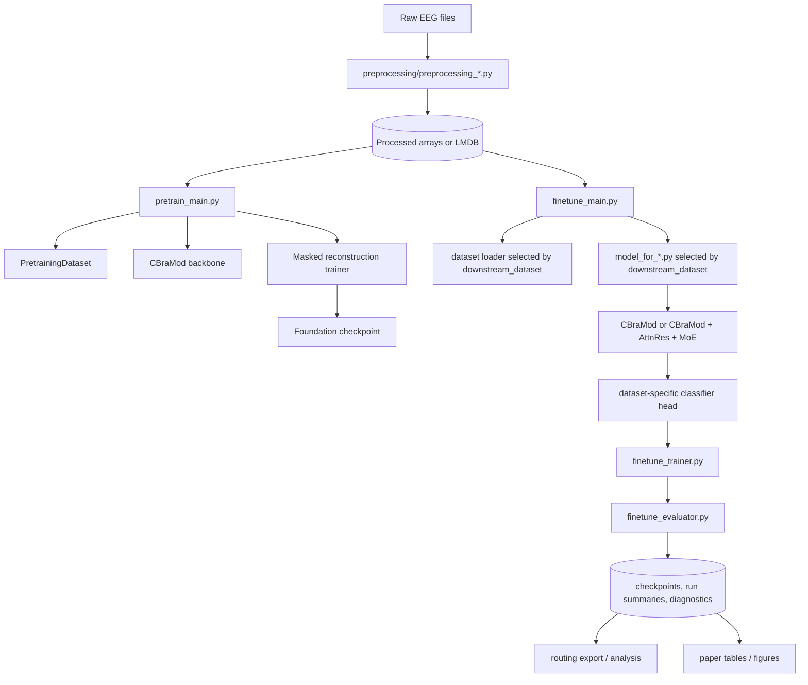
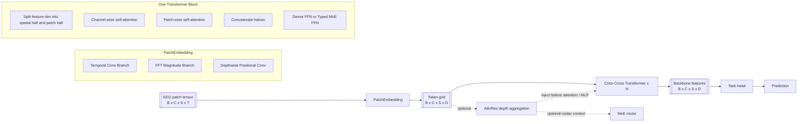

<div align="center">

# EEGxPlore / CBraMod

_A Criss-Cross Brain Foundation Model for EEG Decoding, with selective adaptation extensions on this branch_

[](https://arxiv.org/abs/2412.07236)
[](https://openreview.net/forum?id=NPNUHgHF2w)
[](https://huggingface.co/weighting666/CBraMod)


</div>

<div align="center">

</div>

<p align="center">
    <a href="#about">About</a>
    | <a href="#what-this-branch-contains">Branch Overview</a>
    | <a href="#repository-map">Repository Map</a>
    | <a href="#model-overview">Model Overview</a>
    | <a href="#script-logic">Script Logic</a>
    | <a href="#setup">Setup</a>
    | <a href="#pretraining">Pretraining</a>
    | <a href="#finetuning">Finetuning</a>
    | <a href="#paper-oriented-notes">Paper Notes</a>
    | <a href="#citation">Citation</a>
</p>

## About
This repository centers on **CBraMod**, an EEG foundation model built around a **criss-cross transformer backbone** that operates on patchified EEG tensors. The original backbone is used for:

- masked EEG reconstruction pretraining
- downstream EEG classification / decoding
- cross-dataset transfer via pretrained initialization

On the `EEGxPlore` branch, the codebase has been extended into a fuller research pipeline with:

- dataset-specific preprocessing and LMDB packaging
- finetuning across multiple EEG benchmarks
- **AttnRes** depth aggregation variants
- **typed MoE selective adaptation** in upper transformer layers
- routing diagnostics and post-hoc analysis utilities

The original paper is available on [arXiv](https://arxiv.org/abs/2412.07236) and [OpenReview](https://openreview.net/forum?id=NPNUHgHF2w).

<div align="center">

</div>

## What This Branch Contains
A useful way to think about the branch is:

1. `preprocessing/` converts raw datasets into standardized tensors and storage formats.
2. `datasets/` loads those tensors into train/val/test PyTorch dataloaders.
3. `models/` defines the CBraMod backbone and dataset-specific prediction heads.
4. `pretrain_main.py` and `pretrain_trainer.py` handle masked reconstruction pretraining.
5. `finetune_main.py`, `finetune_trainer.py`, and `finetune_evaluator.py` handle supervised downstream training.
6. `scripts/` contains reproducible local and Slurm launchers, especially for SEED-V and FACED experiments.
7. `utils/` contains routing, metadata, masking, and logging helpers.

In short, this repo is no longer only “a model file plus training loop”. It is an end-to-end EEG experimentation pipeline.

## Repository Map

### Top-level folders
- `datasets/`: dataset loaders for FACED, SEED-V, ISRUC, PhysioNet-MI, Mumtaz2016, TUEV, and legacy datasets.
- `docs/`: notes, paper drafting materials, and modification logs.
- `figure/`: architecture and result figures.
- `models/`: CBraMod backbone, criss-cross transformer, AttnRes, MoE, and task heads.
- `preprocessing/`: dataset preparation scripts.
- `pretrained_weights/`: pretrained checkpoint notes / storage location.
- `scripts/`: local shell launchers and Slurm submission scripts.
- `utils/`: shared utilities and routing analysis helpers.
- `output/`: checkpoints and run summaries written during experiments.
- `logs/`: stdout/stderr and cluster logs.

### Main entry points
- `pretrain_main.py`: launches masked reconstruction pretraining.
- `finetune_main.py`: launches downstream supervised finetuning.
- `quick_example.py`: minimal example of loading the pretrained backbone and attaching a classifier.

## Model Overview

### Input representation
Across the codebase, the backbone expects EEG tensors shaped like:

- `x: [B, C, S, T]`
- `B`: batch size
- `C`: number of channels
- `S`: number of patches / segments
- `T`: points per patch

For example, many downstream runs use `T = 200`, while `C` and `S` depend on the dataset and preprocessing protocol.

### Backbone summary
The CBraMod backbone in [`models/cbramod.py`](models/cbramod.py) has three main stages:

1. **Patch embedding**
2. **Criss-cross transformer encoder**
3. **Output projection**

In finetuning, the output projection is usually replaced with `Identity()`, and a dataset-specific classifier head consumes the backbone features.

### Patch embedding block
`PatchEmbedding` in [`models/cbramod.py`](models/cbramod.py) combines three signals:

1. **Temporal/local convolutional embedding**
   - raw EEG patches are reshaped and processed by stacked `Conv2d + GroupNorm + GELU` layers
2. **Spectral embedding**
   - an `rFFT` is computed per patch
   - the magnitude spectrum is projected into the model dimension through `Linear(101 -> d_model)`
3. **Positional encoding**
   - a depthwise `Conv2d` is applied over the `[channel, patch]` grid to inject local spatial/segment context

The patch embedding output has shape:

- `[B, C, S, D]`

where `D = d_model`.

### Criss-cross transformer block
Each block in [`models/criss_cross_transformer.py`](models/criss_cross_transformer.py) operates on `[B, C, S, D]` and splits the feature dimension into two halves:

- **spatial half**: attends across channels for each patch
- **temporal/segment half**: attends across patches for each channel

Implementation logic:

1. Split `x` into `xs = x[..., :D/2]` and `xt = x[..., D/2:]`
2. Reshape `xs` so attention runs along the **channel axis**
3. Reshape `xt` so attention runs along the **patch axis**
4. Apply two separate `MultiheadAttention` modules
5. Concatenate the updated halves back together
6. Apply FFN or MoE FFN

This is the “criss-cross” idea in code: one branch mixes information across channels, and the other mixes information across time patches.

### AttnRes extension
This branch adds **AttnRes** in [`models/attn_res.py`](models/attn_res.py).

`FullAttnRes` treats earlier hidden states as a depth-wise source pool and learns a soft aggregation over them using:

- RMS normalization of source states
- a learnable depth query vector
- softmax weighting over source depth

The main variants exposed through `--attnres_variant` are:

- `none`: original CBraMod block
- `pre_attn`: aggregate depth history before self-attention
- `pre_mlp`: aggregate depth history before FFN
- `full`: use both pre-attention and pre-MLP AttnRes, plus final AttnRes aggregation
- `final`: use final aggregation behavior in the encoder output path

Optional gating (`--attnres_gated`) blends the current layer input with the depth-aggregated state instead of fully replacing it.

### MoE selective adaptation
This branch also adds a **typed capacity-constrained MoE FFN** in [`models/moe.py`](models/moe.py).

Current design:

- only the **top `moe_num_layers` transformer layers** use MoE
- each MoE layer contains:
  - one shared dense FFN
  - one bank of **spatial specialists**
  - one bank of **spectral specialists**
- routing is **top-1 per bank** with capacity handling
- if a specialist is saturated, the sample can fall back toward shared processing

The router can use different context sources:

- baseline and AttnRes features from the current block
- compact PSD summaries
- compact EEG summaries
- AttnRes depth summaries / learned block summaries
- FACED metadata-derived domain IDs for domain-aware bias

This makes the branch especially relevant for experiments on **selective adaptation** rather than only full dense finetuning.

### Dataset-specific heads
Most dataset wrappers in `models/model_for_*.py` follow the same pattern:

1. instantiate `CBraMod`
2. optionally load pretrained foundation weights
3. set `backbone.proj_out = nn.Identity()`
4. attach a task head

Common head styles:

- `avgpooling_patch_reps`: pool features and classify from a global vector
- `all_patch_reps_onelayer`: flatten all patch representations and use one linear layer
- `all_patch_reps_twolayer`: flatten and use a shallow MLP head
- `all_patch_reps`: flatten and use a larger MLP head

Special case:

- [`models/model_for_isruc.py`](models/model_for_isruc.py) first encodes each EEG epoch with the backbone, then runs a second sequence transformer across epoch-level features for sleep staging.

## Script Logic

### 1. Pretraining path
The pretraining path is simple and self-contained:

```text
pretrain_main.py
  -> datasets/pretraining_dataset.py
  -> models/cbramod.py
  -> pretrain_trainer.py
  -> checkpoint save
```

What each file does:

- `pretrain_main.py`
  - parses hyperparameters
  - builds `PretrainingDataset`
  - instantiates `CBraMod`
  - passes everything to `pretrain_trainer.Trainer`
- `datasets/pretraining_dataset.py`
  - reads LMDB entries from `__keys__`
  - returns pretraining patches only
- `pretrain_trainer.py`
  - creates random masks with `utils.util.generate_mask`
  - runs masked reconstruction
  - computes `MSELoss` on masked positions
  - saves the best checkpoint by reconstruction loss

So the pretraining objective is **masked EEG reconstruction**, not classification.

### 2. Finetuning path
The finetuning path is the main experimental workflow:

```text
finetune_main.py
  -> build_dataset(args)
  -> build_model(args)
  -> finetune_trainer.py
  -> finetune_evaluator.py
  -> checkpoints + summaries + diagnostics
```

What each file does:

- `finetune_main.py`
  - parses a large number of experiment options
  - validates arguments
  - chooses the correct dataset loader
  - chooses the correct model wrapper
  - launches either multiclass or binary training

- `finetune_trainer.py`
  - builds optimizer and cosine scheduler
  - supports freezing the backbone
  - supports class weighting and label smoothing
  - supports EMA tracking of model parameters
  - supports component-wise LR groups for backbone/router/experts/classifier
  - adds MoE auxiliary loss when enabled
  - writes checkpoints and diagnostic JSON/JSONL artifacts

- `finetune_evaluator.py`
  - computes balanced accuracy, weighted F1, Cohen’s kappa for multiclass runs
  - computes balanced accuracy, PR-AUC, AUROC for binary runs
  - supports sequence-style evaluation for ISRUC by flattening label dimensions

### 3. Dataset loader logic
The supported downstream datasets in the current `finetune_main.py` path are:

- FACED
- SEED-V
- ISRUC
- PhysioNet-MI
- Mumtaz2016
- TUEV

General loader pattern:

- build train/val/test splits
- load either LMDB entries or preprocessed arrays
- normalize samples with `/100`
- collate to float tensors and long labels

Important dataset-specific differences:

- `datasets/faced_dataset.py`
  - reads train/val/test keys from LMDB `__keys__`
  - can also return sample keys and FACED domain metadata for routing export / domain-aware MoE
- `datasets/seedv_dataset.py`
  - supports default LMDB `__keys__` split or an external manifest override
  - prints split diagnostics and expected tensor shape warnings
- `datasets/isruc_dataset.py`
  - reads `.npy` sequence/label pairs from subject folders
  - uses an 80/10/10 subject-level split
- `datasets/physio_dataset.py` and `datasets/mumtaz_dataset.py`
  - read LMDB split keys directly
- `datasets/tuev_dataset.py`
  - reads preprocessed `.pkl` files from deterministic split folders

### 4. Model wrapper logic
The `models/model_for_*.py` files mainly do two things:

- adapt the shared CBraMod backbone to a dataset-specific input/output layout
- define the downstream classifier head

In practice, almost all of the modeling novelty lives in:

- [`models/cbramod.py`](models/cbramod.py)
- [`models/criss_cross_transformer.py`](models/criss_cross_transformer.py)
- [`models/attn_res.py`](models/attn_res.py)
- [`models/moe.py`](models/moe.py)

The dataset-specific model files are mostly head wrappers plus pretrained-weight loading logic.

### 5. Utility logic
Utilities that matter most for understanding experiments:

- `utils/util.py`
  - tensor conversion
  - pretraining mask generation
- `utils/faced_meta.py`
  - parses FACED keys and recording metadata
  - maps metadata to domain IDs for MoE bias terms
- `utils/faced_routing_export.py`
  - exports per-sample router behavior for FACED experiments
- `utils/faced_routing_analyze.py`
  - aggregates routing behavior by expert, entropy, and metadata groups

## End-to-End Workflow Graph



## Block-Level Graph
This graph is closer to what you would want for a methods figure draft.



## Setup
Install [Python](https://www.python.org/downloads/) and [PyTorch](https://pytorch.org/get-started/locally/), then install the remaining requirements:

```bash
pip install -r requirements.txt
```

## Pretraining
Run masked reconstruction pretraining with:

```bash
python pretrain_main.py \
  --dataset_dir <LMDB_PRETRAIN_DIR> \
  --model_dir <OUTPUT_DIR>
```

Key defaults in the current code:

- `n_layer = 12`
- `nhead = 8`
- `d_model = 200`
- `mask_ratio = 0.5`
- loss = masked-position `MSELoss`

A pretrained checkpoint is also available on [Hugging Face](https://huggingface.co/weighting666/CBraMod).

## Finetuning
Run downstream training with:

```bash
python finetune_main.py \
  --downstream_dataset SEED-V \
  --datasets_dir <DATA_DIR> \
  --num_of_classes 5 \
  --model_dir <OUTPUT_DIR> \
  --use_pretrained_weights
```

### Ready-made launchers
Local examples:

```bash
bash scripts/run_seedv.sh
bash scripts/run_faced.sh
```

Cluster example:

```bash
sbatch scripts/SEED-V/submit_seedv_train.slurm
```

### What gets written during a run
Typical `model_dir` outputs include:

- best checkpoints
- `run_summary_<dataset>_<timestamp>.json`
- `epoch_diagnostics.jsonl`
- optional EMA comparison summaries
- optional MoE diagnostics such as:
  - `block_summary_stats.json`
  - `router_context_stats.json`
  - `routing_diagnostics.json`

These files are especially useful for writing the experimental section of a paper, because they capture both final metrics and internal routing behavior.

## Preprocessing
The preprocessing scripts in `preprocessing/` are dataset-specific. They convert raw data into standardized arrays or LMDB records with train/val/test split definitions.

Representative examples:

- `preprocessing/preprocessing_SEEDV.py`
  - supports both the CBraMod benchmark protocol and a legacy subject-disjoint protocol
  - parses session/trial timestamps and labels
  - writes LMDB entries with split indices
- `preprocessing/preprocessing_faced.py`
  - resamples FACED signals
  - slices each trial into fixed windows
  - writes LMDB samples and split keys
- `preprocessing/README.md`
  - documents split caveats for TUAB/TUEV and why deterministic preprocessing matters

If you plan to report benchmark numbers, the preprocessing protocol matters as much as the model configuration.

## Quick Start
Minimal example of loading the backbone and attaching a custom classifier:

```python
import torch
import torch.nn as nn
from einops.layers.torch import Rearrange
from models.cbramod import CBraMod

device = torch.device("cuda:0" if torch.cuda.is_available() else "cpu")

model = CBraMod().to(device)
model.load_state_dict(torch.load("pretrained_weights/pretrained_weights.pth", map_location=device))
model.proj_out = nn.Identity()

classifier = nn.Sequential(
    Rearrange('b c s p -> b (c s p)'),
    nn.Linear(22 * 4 * 200, 4 * 200),
    nn.ELU(),
    nn.Dropout(0.1),
    nn.Linear(4 * 200, 200),
    nn.ELU(),
    nn.Dropout(0.1),
    nn.Linear(200, 4),
).to(device)

mock_eeg = torch.randn((8, 22, 4, 200)).to(device)
logits = classifier(model(mock_eeg))
print(logits.shape)
```

## Paper-Oriented Notes
If your immediate goal is a conference paper, the code suggests a clean methods narrative:

1. **Input**: patchified EEG tensor `[B, C, S, T]`
2. **Embedding**: temporal conv embedding + spectral FFT embedding + positional conv
3. **Backbone**: criss-cross transformer blocks mixing channel-wise and patch-wise interactions
4. **Depth aggregation**: optional AttnRes over prior hidden states
5. **Selective adaptation**: optional typed MoE in upper layers with routing context from hidden-state summaries and metadata
6. **Task head**: flatten-and-MLP or sequence-aware classifier depending on the dataset

A practical figure decomposition for the paper would be:

- **Panel A**: overall pipeline from raw EEG to prediction
- **Panel B**: patch embedding block
- **Panel C**: one criss-cross transformer block
- **Panel D**: AttnRes depth aggregation and MoE routing context
- **Panel E**: dataset-specific head examples

The Mermaid graphs above are meant to be a first textual blueprint for that figure.

## Citation
If you use this repository in your research, please cite:

```bibtex
@inproceedings{wang2025cbramod,
    title={{CB}raMod: A Criss-Cross Brain Foundation Model for {EEG} Decoding},
    author={Jiquan Wang and Sha Zhao and Zhiling Luo and Yangxuan Zhou and Haiteng Jiang and Shijian Li and Tao Li and Gang Pan},
    booktitle={The Thirteenth International Conference on Learning Representations},
    year={2025},
    url={https://openreview.net/forum?id=NPNUHgHF2w}
}
```
